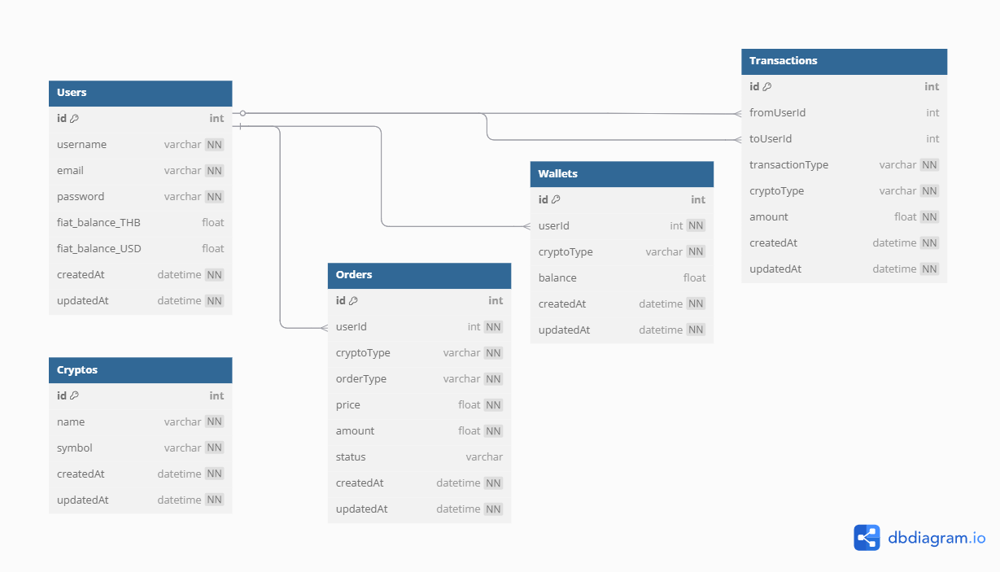

# Backend-Crypto-P2P-Exchange
## วิธีติดตั้งและรันโปรเจกต์
```bash
git clone https://github.com/aunlaphat/Backend-Crypto-C2C.git
npm install
npx sequelize-cli db:migrate
npx sequelize-cli db:seed:all
npm run dev
```
## วิธีทดสอบ api ใน postman
- เปิด Postman
- Import ไฟล์ api-test-postman.json ที่อยู่ในโปรเจคเข้า postman
- ทดสอบ API ได้ 

## ER Diagram


## 📍Flow ระบบ
✅ Step 1: Register / Login

POST /users/register  
👉 สร้างบัญชีผู้ใช้ใหม่ (Users table)

POST /users/login  
👉 Login สำเร็จได้ token  
    - ใช้ token นี้แนบทุก API ถัดไป (Authorization header)

✅ Step 2: ตรวจสอบยอดเงิน Crypto

GET /wallets/:userId/balance  
👉 ดูยอด crypto ใน wallet ของ user

✅ Step 3: การโอน Crypto

POST /wallets/transfer  
👉 โอน crypto ภายในระบบ (user to user)  
    - Update wallet balance ของผู้ส่งและผู้รับ  
    - สร้าง Transaction record (transfer-internal)

POST /wallets/external-transfer  
👉 โอน crypto ออกนอกระบบ (external address)  
    - ลดยอด wallet ผู้ส่ง  
    - สร้าง Transaction record (transfer-external)

✅ Step 4: การสร้างคำสั่งซื้อ-ขาย (Order)

POST /orders/create  
👉 สร้างคำสั่งซื้อหรือขาย crypto  
    - ระบบ Auto Match Order อัตโนมัติ  
    - ถ้ามีคำสั่งฝั่งตรงข้าม:  
        - ระบบจะ สร้าง Trade record  
        - อัปเดต Wallet (ผู้ซื้อและผู้ขาย)  
        - เปลี่ยน order เป็น "completed"

GET /orders/list  
👉 ดูรายการ order ทั้งหมดที่ "pending"

✅ Step 5: ตรวจสอบประวัติ Transaction

GET /transactions/user/:userId  
👉 ดูประวัติ transaction ของ user ทั้งหมด  
    - internal / external transfer  
    - buy / sell


## คำอธิบาย
- โปรเจกต์นี้สร้างด้วย Node.js และ Sequelize โดยใช้ SQLite เป็นฐานข้อมูลในเครื่อง
- สามารถจำลองระบบซื้อขายเหรียญแบบ P2P ได้